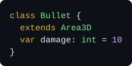

# GD++
<p align="right">
  
</p>

Write Godot games in C++, without the boilerplate.

GD++ is a programming language for Godot: a small domain-specific language that compiles to C++, and plugs into Godot through GDExtension. Its declarations look like GDScript, and its function bodies are plain C++. GD++ turns each class into the C++ you would write by hand with godot-cpp, including the glue code that Godot needs: headers, `_bind_methods`, getters, setters, `#include` lines and class registration. So you get the speed of C++ and full access to godot-cpp, without the boilerplate.

GD++ comes as one command line tool, `gd++`: the compiler, plus a small build system that downloads the Godot C++ bindings, and builds your code into GDExtension libraries that Godot loads like its own modules. A new project takes a couple of commands to set up. Everything is documented in a manual built into the tool: see [The manual](#the-manual).

> [!NOTE]
> The code was mostly written by AI, but a senior engineer made all design decisions.

## A first look

<a href="readme/player.gd++"></a>

Save it as `player.gd++` anywhere in a Godot project, and run:

```sh
gd++ init . --bind 10.0.0-stable --spec 4.7.2-stable
gd++ fetch --missing
gd++ build
```

Open the project in Godot: `Player` is now a node type, like any built-in node, with `health` and `speed` in the inspector, and its doc comment in the editor's help. Rebuild while the editor is open, and it picks up the changes.

To see the C++ that GD++ writes for you, run `gd++ trans player.gd++`.

## Getting started

You need Godot 4, and Go to build `gd++` itself:

```sh
make && sudo make install   # builds gd++ and copies it to /usr/local/bin
```

Then install the tools that compile C++ (Git, SCons, Python and a C++ compiler):

```sh
gd++ install          # asks before running anything
gd++ install --echo   # or just prints the commands, to run them yourself
```

`gd++ install` supports Debian, Ubuntu, Fedora, Arch, openSUSE, macOS (with Homebrew) and Windows (with winget), but it's experimental and hasn't been tested on every platform. On Linux and macOS, it also installs MinGW-w64, to build for Windows.

You never download godot-cpp or anything else from Godot yourself: GD++ does it for you.

## The manual

GD++ has a full reference manual built in, so it always matches the version you run, and works offline. It's the main documentation: this README only gives an overview.

```sh
gd++ man              # list all pages, in reading order
gd++ man intro        # start here
gd++ man tour         # a walk through a first project
gd++ man functions    # read any page by its name
```

The manual is a tree of pages. At the top are `intro`, `tour`, and three sections:

- `tool`: the build tool, i.e. how projects, packages, dependencies and builds work.
- `cmd`: the commands, one page per `gd++` command, with all its options, e.g. `gd++ man build`.
- `lang`: the GD++ language, one page per topic, from the syntax to the C++ that GD++ generates.

A section is a page too: `gd++ man lang` gives an overview of the language, and lists its pages. Page names are unique, so `gd++ man functions` and `gd++ man lang/functions` show the same page. Pages open in a pager when they don't fit the terminal, and print as plain text when piped, e.g. `gd++ man signals | grep emit`. The language pages describe the syntax version of the package you're in.

Two more ways to learn: [tutorial/tutorial.gd++](tutorial/tutorial.gd++) is a tour of the language in one file, and `gd++ trans` on any file shows the C++ that GD++ generates from it.

## The language by example

GD++ is not GDScript: blocks use braces, not indentation, function bodies are C++, and every value has a static type. Types are Godot's, e.g. `int`, `Vector3` or `Node3D`, and each one maps to a C++ type, e.g. `int64_t`, `Vector3` and `Node3D *`.

### Functions

<a href="readme/functions.gd++"></a>

The signature is GD++, and the body is C++. GD++ binds the function, so GDScript can call it too. `gd` is short for `UtilityFunctions`, Godot's global functions.

### Variables and properties

<a href="readme/variables.gd++"></a>

### Signals, enums and casts

<a href="readme/signals.gd++"></a>

### Work on other threads

<a href="readme/threads.gd++"></a>

A call to an `@onthread` function returns right away, with an `Async` task that holds the result once it's ready. No frame waits for the search.

### Inline classes

<a href="readme/classes.gd++"></a>

A file can hold any number of classes. `@tool` runs a class's code in the editor too, and `@icon("res://player.svg")` gives it an icon.

## Why GD++

- **Less code.** Plain godot-cpp asks you to repeat yourself: a header, a source file, a binding for every method and property, a getter and a setter for each, and registration code. GD++ writes all of it, and the result is the C++ you would have written by hand.
- **Speed.** Your own logic, like math and loops, runs 15 to 50 times faster than in GDScript, in release builds. See `gd++ man performance`.
- **No `#include` lines.** GD++ finds every class that your code uses, and includes its header.
- **Plain C++ when you need it.** Everything godot-cpp offers works in function bodies, and you can mix GD++ with hand-written C++ classes in the same package.
- **One tool.** Like Godot itself, GD++ ships everything in one program: the compiler, the build system, the dependency manager and the manual.

## All language features

Each feature has its page in the manual:

- Classes: file-level with `class_name`, or inline with `class Name { ... }`. See `gd++ man classes`.
- `@tool` classes: run the class's code in the editor too. See `gd++ man classes`.
- `@game_only` classes: run the class's code only in the game, never in the editor. See `gd++ man classes`.
- `@icon`: give a class its icon in the editor. See `gd++ man classes`.
- Typed arrays and dictionaries: `Array[T]` and `Dictionary[K, V]`. See `gd++ man types`.
- Casts: `value as T` converts between any two types, and checks downcasts. See `gd++ man cast`.
- Properties: variables with their own `get` and `set` blocks. See `gd++ man variables`.
- `@onready` variables: get their values when the node is ready, like in GDScript. See `gd++ man lifecycle`.
- Exports: `@export` and its family (`@export_range`, `@export_enum`, `@export_flags`, `@export_file`, `@export_dir`, `@export_multiline`, `@export_placeholder`, `@export_storage`), to show variables in the inspector. See `gd++ man exports`.
- Inspector sections: `@export_category`, `@export_group` and `@export_subgroup`. See `gd++ man exports`.
- Signals: `signal name(params)`, sent with `emit name(args)`. See `gd++ man signals`.
- `@override` functions: override an engine callback, e.g. `_ready`, or a `@virtual` function of a GD++ base class. See `gd++ man functions`.
- `@virtual` functions: let subclasses and GDScript override them. `@final` stops further overrides. See `gd++ man functions`.
- `@const` and `@static` functions: const methods and static functions. See `gd++ man functions`.
- Default values: any C++ expression, even a whole block of code. See `gd++ man functions`.
- `@deferred` functions: every call runs later, through `call_deferred`. See `gd++ man functions`.
- `@thread_safe` functions: calls from other threads run later, on the main thread. See `gd++ man functions`.
- `@onthread` functions: run on a worker thread, and return an `Async` task, used with `is_done`, `claim`, `cancel` and `is_cancelled`. See `gd++ man async`.
- `@rpc` functions: callable over the network, with `rpc name(args)` or `rpc(peer) name(args)`. See `gd++ man rpc`.
- Enums and constants: `enum Name { A, B, C }` and `enum NAME = 42`, with values computed from other values. See `gd++ man enums`.
- `@bitfield` enums: values are flags, 1, 2, 4 and so on. See `gd++ man enums`.
- Extending enums: copy the values of a GD++ or engine enum, e.g. `extends Node.ProcessMode`. See `gd++ man enums`.
- Constructors and destructors: `ctor { ... }` and `dtor { ... }`. See `gd++ man lifecycle`.
- Notification handlers: `notif(PREDELETE) { ... }` runs on Godot's notifications. See `gd++ man lifecycle`.
- Externs: use classes of other packages, GDExtensions and scripts at runtime, with `extern` or `extern_name`. See `gd++ man externs`.
- `@trace`: print calls, variable changes, signals and object lifetimes while the game runs. See `gd++ man debugging`.
- `@profile`: time code, live in the editor's monitors. See `gd++ man debugging`.
- `decl`, `impl` and `@global` blocks: put any C++ into the generated files. See `gd++ man code`.
- `import` and `noimport`: adjust the automatic includes. See `gd++ man includes`.
- Doc comments: `///` and `/** */` become the editor's help, with tutorials and `@deprecated` and `@experimental` marks. See `gd++ man docs`.
- `gd_assert`: like GDScript's `assert`, and gone in release builds. See `gd++ man runtime`.
- `GDPP_STRING_NAME`: a `StringName` that's created once and reused, for fast calls by name. See `gd++ man runtime`.

`@trace` and `@profile` generate no code unless a build turns them on, e.g. with `gd++ build --trace Player`, so you can leave them in your code for good.

## The build tool

A **project** is a normal Godot project. A **package** is a directory in it with a `gd++pkg.toml` file, and builds into one GDExtension library, from all the GD++ and C++ files in it. **Dependencies** are the Godot C++ bindings (godot-cpp) and the Godot API specs that packages build with.

```sh
gd++ init --vcs git                                       # keep GD++'s files out of git
gd++ init . --bind 10.0.0-stable --spec 4.7.2-stable      # make the project root a package
gd++ init tools --bind 10.0.0-stable --spec 4.7.2-stable  # or add a package anywhere

gd++ fetch --index            # list the dependencies that are available
gd++ fetch --missing          # download what the packages need
gd++ checkin --spec 4.7.2-stable   # commit a dependency with the project
gd++ vendor --spec my-4.7 --from my-4.7   # add a custom one, e.g. from your own Godot build

gd++ build                    # build the package you're in, for this machine, in debug mode
gd++ build --proj             # build every package of the project
gd++ build --ship --for l.x64 w.x64   # release builds for Linux and Windows
gd++ clean                    # delete the build cache

gd++ ls                       # an overview of the project
gd++ trans player.gd++        # print the C++ that GD++ generates from a file
gd++ doc TypedArray           # show what godot-cpp declares under a name
gd++ cat player.gd++          # show a file, highlighted
gd++ fix                      # tidy up the project
gd++ man                      # the reference manual, built in
```

The build writes the libraries and a `.gdextension` file into the package root, so Godot loads them right away. Debug builds support hot reload. A package can also hold plain C++ classes, written the usual godot-cpp way: `gd++ init . --class Foo --include pkg://foo.h` registers them with Godot.

## Status

GD++ is ready to be used, but it's still experimental. It comes with **absolutely no warranty**. Language versions are designed for backward compatibility (see the table below), and breaking changes are unlikely, but at this point no guarantees of any kind can be given.

| Syntax | Status |
|---|---|
| 0 | Nightly: the language as it's being developed, with no backward compatibility. Never use it in production. |
| 1 | Stable in theory, but experimental in practice. |

Each package chooses its syntax version in its `gd++pkg.toml`. Future syntax versions are expected to be stable in practice, not just in theory.

## License and credits

GD++ is licensed under the [MIT License](LICENSE).

GD++ was created by [caphindsight](https://github.com/caphindsight). The MIT License doesn't require it, but if GD++ helps you make a game, a mention in its credits would be very much appreciated.
