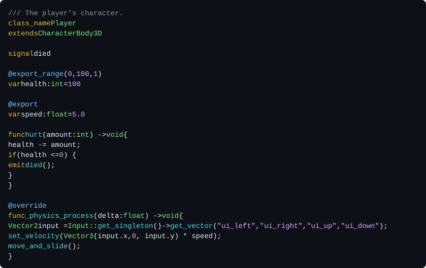
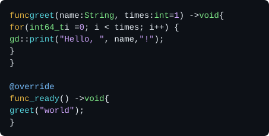
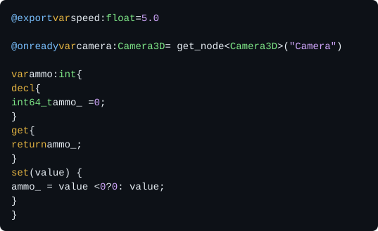
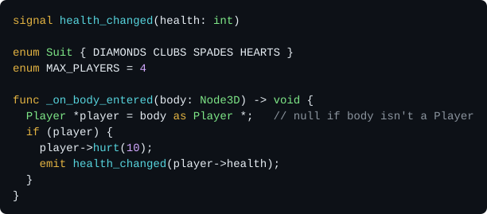
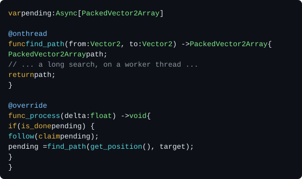
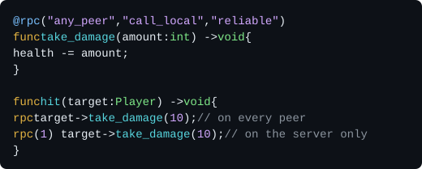

# GD++
<p align="right">
  
</p>

Write Godot games in flavoured C++, without the boilerplate.

GD++ is a programming language for Godot. It compiles to C++, and plugs into Godot through GDExtension. It's inspired by the conciseness and simplicity of GDScript.

GD++ mixes GDScript and C++, but it is neither GDScript nor C++:

- Declarations look like GDScript.
- Function bodies are flavoured C++: C++ with a few custom words, like `emit` to send a signal.

GD++ writes the C++ you would write by hand with godot-cpp: headers, `_bind_methods`, getters, setters, `#include` lines and class registration. Math and loops run 15 to 50 times faster than in GDScript (see `gd++ man performance`).

GD++ comes as one command line tool, `gd++`: the compiler, a build system that downloads godot-cpp for you, and a built-in manual.

> [!NOTE]
> The code was mostly written by AI, but a senior engineer made all design decisions.

## A first look

<a href="readme/player.gd++"></a>

Save it as `player.gd++` anywhere in a Godot project, and run:

```sh
gd++ init . --bind 10.0.0-stable --spec 4.7.2-stable
gd++ fetch --missing
gd++ build
```

Open the project in Godot: `Player` is now a node type, like any built-in node. Debug builds hot reload while the editor is open.

To see the C++ that GD++ writes for you, run `gd++ trans player.gd++`.

## Getting started

You need Godot 4, and Go to build `gd++` itself:

```sh
make && sudo make install   # builds gd++ and copies it to /usr/local/bin
```

Then install the tools that compile C++ (Git, SCons, Python and a C++ compiler):

```sh
gd++ install          # asks before running anything
gd++ install --echo   # or just prints the commands, to run them yourself
```

`gd++ install` supports Debian, Ubuntu, Fedora, Arch, openSUSE, macOS (with Homebrew) and Windows (with winget). It's experimental, and hasn't been tested on every platform. On Linux and macOS, it also installs MinGW-w64, to build for Windows.

## The manual

The full documentation is built into the tool, and matches the version you run. Run `gd++ man` to list its pages, and start with `gd++ man intro`. The language pages describe the syntax version of the package you're in.

[tutorial/tutorial.gd++](tutorial/tutorial.gd++) is a tour of the language in one file.

## The language by example

Unlike GDScript, blocks use braces, and every value has a static type. Types are Godot's, e.g. `int`, `Vector3` or `Node3D`. Each one maps to a C++ type, e.g. `int64_t`, `Vector3` and `Node3D *`.

### Functions

<a href="readme/functions.gd++"></a>

For GD++'s custom words in C++, see `gd++ man rewrites`. GD++ binds the function, so GDScript can call it too. `gd` is short for `UtilityFunctions`, Godot's global functions.

### Variables and properties

<a href="readme/variables.gd++"></a>

### Signals, enums and casts

<a href="readme/signals.gd++"></a>

### Multithreading

<a href="readme/threads.gd++"></a>

A call to an `@onthread` function returns right away, with an `Async` task. The task holds the result once it's ready. No frame waits for the search.

### Multiplayer

<a href="readme/rpc.gd++"></a>

`@rpc` takes the same arguments as in GDScript. `rpc` calls the function on other peers.

## All language features

Each feature has its page in the manual:

- Classes: file-level with `class_name`, or inline with `class Name { ... }`. See `gd++ man classes`.
- `@tool` classes: run the class's code in the editor too. See `gd++ man classes`.
- `@game_only` classes: run the class's code only in the game. See `gd++ man classes`.
- `@icon`: give a class its icon in the editor. See `gd++ man classes`.
- Typed arrays and dictionaries: `Array[T]` and `Dictionary[K, V]`. See `gd++ man types`.
- Casts: `value as T` converts between any two types, and checks downcasts. See `gd++ man cast`.
- Properties: variables with their own `get` and `set` blocks. See `gd++ man variables`.
- `@onready` variables: get their values when the node is ready. See `gd++ man lifecycle`.
- Exports: `@export` and its family, e.g. `@export_range`, show variables in the inspector. See `gd++ man exports`.
- Inspector sections: `@export_category`, `@export_group` and `@export_subgroup`. See `gd++ man exports`.
- Signals: `signal name(params)`, sent with `emit name(args)`. See `gd++ man signals`.
- `@override` functions: override an engine callback, e.g. `_ready`, or a `@virtual` function. See `gd++ man functions`.
- `@virtual` functions: subclasses and GDScript can override them. `@final` stops that. See `gd++ man functions`.
- `@const` and `@static` functions. See `gd++ man functions`.
- Default values: any C++ expression, even a block of code. See `gd++ man functions`.
- `@deferred` functions: every call runs later, through `call_deferred`. See `gd++ man functions`.
- `@thread_safe` functions: calls from other threads run later, on the main thread. See `gd++ man functions`.
- `@onthread` functions: run on a worker thread, and return an `Async` task. See `gd++ man async`.
- `@rpc` functions: callable over the network, with `rpc name(args)`. See `gd++ man rpc`.
- Enums and constants: `enum Name { A B C }` and `enum NAME = 42`. See `gd++ man enums`.
- `@bitfield` enums: values are flags, 1, 2, 4 and so on. See `gd++ man enums`.
- Extending enums: copy the values of another enum, e.g. `extends Node.ProcessMode`. See `gd++ man enums`.
- Constructors and destructors: `ctor { ... }` and `dtor { ... }`. See `gd++ man lifecycle`.
- Notification handlers: `notif(PREDELETE) { ... }`. See `gd++ man lifecycle`.
- Externs: use classes of other packages, GDExtensions and scripts. See `gd++ man externs`.
- `@trace`: print calls, variable changes and signals while the game runs. See `gd++ man debugging`.
- `@profile`: time code, live in the editor's monitors. See `gd++ man debugging`.
- `decl`, `impl` and `@global` blocks: put any C++ into the generated files. See `gd++ man code`.
- `import` and `noimport`: adjust the automatic includes. See `gd++ man includes`.
- Doc comments: `///` and `/** */` become the editor's help. See `gd++ man docs`.
- `gd_assert`: like GDScript's `assert`, and gone in release builds. See `gd++ man runtime`.
- `GDPP_STRING_NAME`: a `StringName` created once, for fast calls by name. See `gd++ man runtime`.

`@trace` and `@profile` generate no code unless a build turns them on, e.g. `gd++ build --trace Player`. So you can leave them in your code for good.

## The build tool

- A **project** is a normal Godot project.
- A **package** is a directory with a `gd++pkg.toml` file. It builds into one GDExtension library.
- **Dependencies** are the Godot C++ bindings (godot-cpp) and the Godot API specs.

```sh
gd++ init --vcs git                                       # keep GD++'s files out of git
gd++ init . --bind 10.0.0-stable --spec 4.7.2-stable      # make the project root a package
gd++ init tools --bind 10.0.0-stable --spec 4.7.2-stable  # or add a package anywhere

gd++ fetch --index            # list the dependencies that are available
gd++ fetch --missing          # download what the packages need
gd++ checkin --spec 4.7.2-stable   # commit a dependency with the project
gd++ vendor --spec my-4.7 --from my-4.7   # add a custom one, e.g. from your own Godot build

gd++ build                    # build the package you're in, for this machine, in debug mode
gd++ build --proj             # build every package of the project
gd++ build --ship --for l.x64 w.x64   # release builds for Linux and Windows
gd++ clean                    # delete the build cache

gd++ ls                       # an overview of the project
gd++ trans player.gd++        # print the C++ that GD++ generates from a file
gd++ doc TypedArray           # show what godot-cpp declares under a name
gd++ cat player.gd++          # show a file, highlighted
gd++ fix                      # tidy up the project
```

The build writes the libraries and a `.gdextension` file into the package root, so Godot loads them right away.

A package can also hold plain C++ classes, written the usual godot-cpp way. `gd++ init . --class Foo --include pkg://foo.h` registers them with Godot.

## Status

GD++ is ready to be used, but it's still experimental, and comes with **absolutely no warranty**. Syntax versions are designed for backward compatibility, but no guarantees can be given yet.

| Syntax | Status |
|---|---|
| 0 | Nightly: the language as it's being developed. Never use it in production. |
| 1 | Stable in theory, but experimental in practice. |

Each package chooses its syntax version in its `gd++pkg.toml`.

## See also

- [gdpp-vim](https://github.com/caphindsight/gdpp-vim): Vim bindings for GD++.
- [Godot Object Compiler](https://github.com/LucaTuerk/godot-object-compiler): a similar project, which generates the boilerplate of GDExtensions from macros in plain C++ code.

## License and credits

GD++ is licensed under the [MIT License](LICENSE).

GD++ was created by [caphindsight](https://github.com/caphindsight). If GD++ helps you make a game, a mention in its credits would be very much appreciated. The MIT License doesn't require it.
