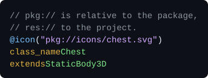
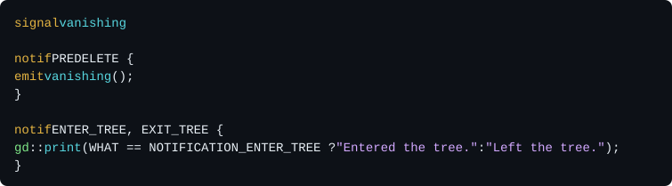

# GD++
<p align="right">
  
</p>

GD++ is a programming language for Godot.
It compiles to C++, and plugs into Godot through GDExtension.
It's inspired by the conciseness and simplicity of GDScript.

GD++ looks like GDScript declarations, with C++ implementation.
But it is neither GDScript nor C++:

- Declarations are transpiled into C++ code that targets GDExtension via [godot-cpp](https://github.com/godotengine/godot-cpp).
- Function bodies are flavoured C++: C++ with a few custom quality of life features.

GD++ toolchain comes as one command line tool, `gd++`: the compiler, a build system that downloads required build dependencies for you, and a built-in manual.

See the [GD++ sources of the Foliage3D addon](https://github.com/caphindsight/Foliage3D/blob/master/readme/index.md) for a real-life project written entirely in GD++.

> [!NOTE]
> **Disclaimer:** The code was mostly written by AI, but a senior engineer made all design decisions.

## Hello World

<a href="readme/svg/hello_world.gd++"></a>

Save it as `hello_world.gd++` (or any other name with extension any of `.gd++`, `.gdpp` or `.gg`) anywhere in a Godot project, and run:

```sh
gd++ init . --bind 10.0.0-stable --spec 4.7.2-stable  # Replace this with the versions you're using.
gd++ fetch --missing
gd++ build
```

Open the project in Godot: `HelloWorldNode` is now a node type.
Add it to the main scene and run it.

## Getting started

You need Godot 4, and Go to build `gd++` itself:

```sh
make && sudo make install   # builds gd++ and copies it to /usr/local/bin
```

Then install the tools that compile C++ (Git, SCons, Python and a C++ compiler):

```sh
gd++ install          # asks before running anything
gd++ install --echo   # or just prints the commands, to run them yourself
```

`gd++ install` supports Debian, Ubuntu, Fedora, Arch, openSUSE, macOS (with Homebrew) and Windows (with winget). It's experimental, and hasn't been tested on every platform. On Linux and macOS, it also installs MinGW-w64, to build for Windows.

## The manual

The full documentation is built into the tool, and matches the version you run. Run `gd++ man` to list its pages, and start with `gd++ man intro` and `gd++ man lang`.

## The language by example

Unlike GDScript, blocks use braces, and every value has a static type. Types are Godot's, e.g. `int`, `Vector3` or `Node3D`. Each one maps to a C++ type, e.g. `int64_t`, `Vector3` and `Node3D *`. Most examples below show a few members of a class, not whole files.

### Includes are automatic

You never write `#include` lines. GD++ knows which header declares each name of godot-cpp and of your package, finds the names your code uses, and includes their headers. To use a class, just use it, even in a cycle: `Player` can use `Enemy`, and `Enemy` can use `Player`. See `gd++ man includes`.

### Classes

<a href="readme/svg/classes.gd++"></a>

A file has at most one file-level class, with `class_name`, and any number of inline ones. Without `extends`, a class extends `RefCounted`. See `gd++ man classes`.

### Creating and deleting objects

<a href="readme/svg/create.gd++"></a>

`create` and `destroy` are GD++ words, meant to create and delete objects of any class, and each kind of GD++ class gives them its own meaning. For example, for a pool class (see "Object pools"), `create` reuses a node from the pool, and `destroy` gives it back instead of deleting it. `create T` gives what GD++ uses for `T`, e.g. a `Ref<ArrayMesh>`, so a refcounted object deletes itself with its last reference, and `destroy` doesn't compile for one. `queue_destroy` destroys a node at the end of the frame, like Godot's `queue_free`, but works with pools too. See `gd++ man classes`.

### Tool classes

<a href="readme/svg/tool.gd++"></a>

It spins in the editor too, but `launch` only runs in the game. Without `@tool`, the editor runs none of the class's code. See `gd++ man classes`.

### Scene classes

<a href="readme/svg/scene.gd++"></a>

`create Enemy` (see above) instantiates `enemy.tscn`, with its children, and gives its root as an `Enemy *`. The scene is loaded once, by the first `create`. If its root isn't an `Enemy`, `create` prints an error and returns null. Classes without `@scene` pay nothing for it. See `gd++ man classes`.

### Class icons

<a href="readme/svg/icon.gd++"></a>

`pkg://` paths are relative to the package, and `res://` paths to the project. See `gd++ man classes`.

### Functions

<a href="readme/svg/functions.gd++"></a>

The signature resembles GDScript, and the body is flavoured C++. GD++ binds the function, so GDScript can call it too. `gd` is short for `UtilityFunctions`, Godot's global functions. See `gd++ man functions`.

### Variables

<a href="readme/svg/variables.gd++"></a>

An initial value is a C++ expression, or a block that returns it. C++ code uses the fields directly, e.g. `health -= 10;`, and GDScript through their getters and setters. See `gd++ man variables`.

### Properties

<a href="readme/svg/properties.gd++"></a>

A `decl` block holds the property's storage. Without `set`, a property is read-only. See `gd++ man variables`.

### Ready-time initial values

<a href="readme/svg/onready.gd++"></a>

Like in GDScript, the value is set when the node gets ready, so its children exist, and `$` and `%` get them by path or unique name. It's set before the `ready` block runs, and before any `_ready`, even a script's. See `gd++ man variables` and `gd++ man lifecycle`.

### Typed arrays and dictionaries

<a href="readme/svg/typed_collections.gd++"></a>

In C++, they're `TypedArray<Item>` and `TypedDictionary<String, int64_t>`. See `gd++ man types`.

### Casts

<a href="readme/svg/cast.gd++"></a>

`as` converts between any two types, like GDScript's `as`. A downcast checks the object's class, and gives null if it doesn't match. See `gd++ man cast`.

### Exports

<a href="readme/svg/exports.gd++"></a>

The inspector shows them, and scenes save them. GD++ has all of GDScript's export annotations. See `gd++ man exports`.

### Inspector sections

<a href="readme/svg/sections.gd++"></a>

With the prefix `stat_`, the group shows `stat_health` as "Health". See `gd++ man exports`.

### Signals

<a href="readme/svg/signals.gd++"></a>

`emit` is one of GD++'s few rewrites in C++, so that sending a signal looks different from a call. See `gd++ man signals` and `gd++ man rewrites`.

### Engine callbacks

<a href="readme/svg/engine.gd++"></a>

Engine blocks, `ready`, `enter_tree`, `exit_tree`, `process(delta)`, `physics_process(delta)` and `draw`, run at the engine's `_ready`, `_process` and the like, from the class's notification handler, so a script that extends the class can't replace them. `process` and `physics_process` also turn processing on. See `gd++ man engine`.

### Overrides

<a href="readme/svg/override.gd++"></a>

It overrides any engine callback, or a `@virtual` function. A function with the name of one needs it, so nothing is overridden by accident. A script's function of the same name replaces it, but with `"super"`, the script can still call it, as `_super_unhandled_input`. See `gd++ man functions`.

### Virtual functions

<a href="readme/svg/virtual.gd++"></a>

A script that extends `Weapon` can override `_damage`, and any script can call it as `damage()`. Scripts that extend `Axe` can override it further, but `"final"` stops overrides for `Sword`. See `gd++ man functions`.

### Const and static functions

<a href="readme/svg/const_static.gd++"></a>

GDScript calls a static function on the class, e.g. `Bomb.damage_at(3.0)`. See `gd++ man functions`.

### Default values

<a href="readme/svg/defaults.gd++"></a>

A default value is a C++ expression, or a block that returns it. See `gd++ man functions`.

### Deferred functions

<a href="readme/svg/deferred.gd++"></a>

Every call, from C++ or GDScript, runs at the end of the frame, through `call_deferred`. See `gd++ man functions`.

### Thread-safe functions

<a href="readme/svg/thread_safe.gd++"></a>

A call from another thread runs later, on the main thread, where it can change the scene tree. See `gd++ man functions`.

### Functions on worker threads

<a href="readme/svg/onthread.gd++"></a>

A call to an `@onthread` function runs it on a worker thread, and returns right away, with an `Async` task. `is_done` tells whether the task is done, and `claim` takes its result. No frame waits for the search. See `gd++ man async`.

### Remote procedure calls

<a href="readme/svg/rpc.gd++"></a>

`@rpc` takes the same arguments as in GDScript. `rpc chat(...)` calls the function on every peer, and `rpc(id) chat(...)` on one. See `gd++ man rpc`.

### Enums and constants

<a href="readme/svg/enums.gd++"></a>

An enum type belongs to the whole package. In C++, it's an enum class. `enum NAME = VALUE` is an integer constant of the class. See `gd++ man enums`.

### Bitfield enums

<a href="readme/svg/bitfield.gd++"></a>

The flags count 1, 2, 4 and so on, and the inspector shows a checkbox for each. In C++, `&` tests as a `bool`, e.g. `if (hits & Layer::PLAYER)`. See `gd++ man enums`.

### Extending enums

<a href="readme/svg/enum_extends.gd++"></a>

`Mode` copies the values of `Node.ProcessMode`, e.g. `INHERIT` and `ALWAYS`, and adds `EDITOR`. That's also how GD++ code uses an engine enum as a type. See `gd++ man enums`.

### Constructors and destructors

<a href="readme/svg/ctor_dtor.gd++"></a>

Neither takes arguments, since Godot creates objects without any. See `gd++ man lifecycle`.

### Weak references

<a href="readme/svg/weak.gd++"></a>

A `Weak[ArrayMesh]`, `Weak<ArrayMesh>` in C++, remembers the mesh without keeping it alive. The cache shares the mesh while something uses it, and lets it go once nothing does. It converts to a `Ref<ArrayMesh>`, or to null once the mesh is freed. It works for nodes too: a `Weak[Enemy]` converts to an `Enemy *`, or to null once the enemy is freed, where a plain `Enemy *` would point to freed memory. See `gd++ man types`.

### Object pools

<a href="readme/svg/pools.gd++"></a>

For a `@pool` class, `destroy` doesn't delete the node. Instead, it removes the node from the tree and keeps it in the pool, and `create` reuses it later. So `ctor` runs only when a bullet is actually created, not each time it's reused. A `@recycle` variable, like `speed`, gets its initial value again each time a bullet is reused. See `gd++ man pools`.

### Notification handlers

<a href="readme/svg/notif.gd++"></a>

`WHAT` is the notification being handled. See `gd++ man lifecycle`.

### Externs

<a href="readme/svg/externs.gd++"></a>

An extern declares a class that lives elsewhere: in another package, another GDExtension, or a script with a `class_name`. Its members are called by name, at runtime. See `gd++ man externs`.

### Tracing

<a href="readme/svg/trace.gd++"></a>

After `gd++ build --trace Player`, the game prints every call and every change:

```out
[f812] ▶ Player "Hero".take_damage(amount: 5)
[f812]   Player "Hero".health: 100 → 95  (in take_damage)
[f812] ◀ Player "Hero".take_damage → false  12.4 µs
```

See `gd++ man debugging`.

### Profiling

<a href="readme/svg/profile.gd++"></a>

After `gd++ build --profile ai`, the editor's monitors show its timings live. `@trace` and `@profile` generate no code unless a build turns them on, so you can leave them in your code for good. See `gd++ man debugging`.

### C++ blocks

<a href="readme/svg/code_blocks.gd++"></a>

`decl` goes into the class's header, and `impl` into its source file. With `@global`, they go outside the class. `This` is the name of the class. See `gd++ man code`.

### Forcing and preventing includes

<a href="readme/svg/import.gd++"></a>

Includes are automatic, but in very rare cases, GD++ can't see a name, e.g. behind `auto`. Then `import` adds its `#include` line, and `noimport` removes one. See `gd++ man includes`.

### Doc comments

<a href="readme/svg/docs.gd++"></a>

They become the editor's help, with Godot's BBCode tags. See `gd++ man docs`.

### Assertions

<a href="readme/svg/asserts.gd++"></a>

An assertion checks what must always be true. In debug builds, a failed assertion prints an error and returns from the function, with a default value if it returns one. GD++ tries hard to keep the game from crashing and to let it go on sensibly, but a failed assertion is always undefined behavior, in debug builds too: it's a bug to fix. To check a condition in a well-defined way, use a plain `if`; what an assertion adds is that release builds drop it entirely, so it costs nothing there. See `gd++ man rewrites`.

### Cached string names

<a href="readme/svg/string_name.gd++"></a>

`string_name "tick"` is short for `GDPP_STRING_NAME("tick")`: a `StringName` created once, and reused by every later call, which makes calls by name faster. See `gd++ man runtime`.

## The build tool

- A **project** is a normal Godot project.
- A **package** is a directory with a `gd++pkg.toml` file. It builds into one GDExtension library.
- **Dependencies** are the Godot C++ bindings (godot-cpp) and the Godot API specs.

```sh
gd++ init --vcs git                                       # keep GD++'s files out of git
gd++ init . --bind 10.0.0-stable --spec 4.7.2-stable      # make the project root a package
gd++ init tools --bind 10.0.0-stable --spec 4.7.2-stable  # or add a package anywhere

gd++ fetch --index            # list the dependencies that are available
gd++ fetch --missing          # download what the packages need
gd++ checkin --spec 4.7.2-stable   # commit a dependency with the project
gd++ vendor --spec my-4.7 --from my-4.7   # add a custom one, e.g. from your own Godot build

gd++ build                    # build the package you're in, for this machine, in debug mode
gd++ build --proj             # build every package of the project
gd++ build --ship --for l.x64 w.x64   # release builds for Linux and Windows
gd++ clean                    # delete the build cache

gd++ ls                       # an overview of the project
gd++ trans player.gd++        # print the C++ that GD++ generates from a file
gd++ doc TypedArray           # show what godot-cpp declares under a name
gd++ cat player.gd++          # show a file, highlighted
gd++ fix                      # tidy up the project
```

The build writes the libraries and a `.gdextension` file into the package root, so Godot loads them right away.

A package can also hold plain C++ classes, written the usual godot-cpp way. `gd++ init . --class Foo --include pkg://foo.h` registers them with Godot. Add `--ptr`, or `--ref` for refcounted classes, to let GD++ code use them by name.

## Status

GD++ is ready to be used, but it's still experimental, and comes with **absolutely no warranty**. Syntax versions are designed for backward compatibility, but no guarantees can be given yet.

| Syntax | Status |
|---|---|
| 0 | Nightly: the language as it's being developed. Never use it in production. |
| 1 | Stable in theory, but experimental in practice. |

Each package chooses its syntax version in its `gd++pkg.toml`.

## See also

- [Foliage3D](https://github.com/caphindsight/Foliage3D): a realistic project by the same author, written fully in GD++, which shows what GD++ can do.
- [gdpp-vim](https://github.com/caphindsight/gdpp-vim): Vim bindings for GD++.
- [Godot Object Compiler](https://github.com/LucaTuerk/godot-object-compiler): a similar project, which generates the boilerplate of GDExtensions from macros in plain C++ code.

## License and credits

GD++ is licensed under the [MIT License](LICENSE).

GD++ was created by [caphindsight](https://github.com/caphindsight). If GD++ helps you make a game, a mention in its credits would be very much appreciated. The MIT License doesn't require it.
