# GD++
<p align="right">
  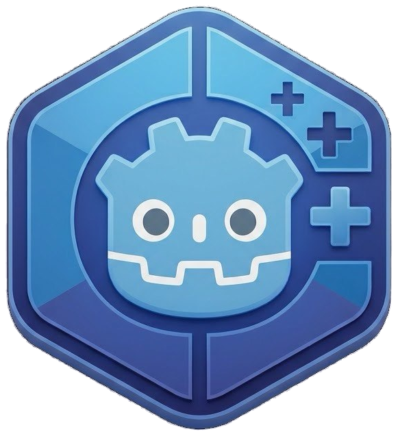
</p>

GD++ is a programming language for Godot.
It compiles to C++, and plugs into Godot through GDExtension.
It's inspired by the conciseness and simplicity of GDScript.

GD++ looks like GDScript declarations, with C++ implementation.
But it is neither GDScript nor C++:

- Declarations are transpiled into C++ code that targets GDExtension via [godot-cpp](https://github.com/godotengine/godot-cpp).
- Function bodies are flavoured C++: C++ with a few custom quality of life features.

GD++ toolchain comes as one command line tool, `gd++`: the compiler, a build system that downloads required build dependencies for you, and a built-in manual.

See the [GD++ sources of the Foliage3D addon](https://github.com/caphindsight/Foliage3D/blob/master/readme/index.md) for a real-life project written entirely in GD++.

> [!NOTE]
> **Disclaimer:** The code was mostly written by AI, but a senior engineer made all design decisions.

## Hello World

<a href="readme/svg/hello_world.gd++">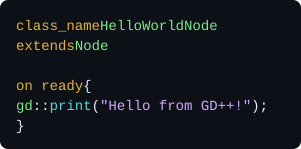</a>

Save it as `hello_world.gd++` (or any other name with extension any of `.gd++`, `.gdpp` or `.gg`) anywhere in a Godot project, and run:

```sh
gd++ init . --bind 10.0.0-stable --spec 4.7.2-stable  # Replace this with the versions you're using.
gd++ fetch --missing
gd++ build
```

Open the project in Godot: `HelloWorldNode` is now a node type.
Add it to the main scene and run it.

## Getting started

You need Godot 4, and Go to build `gd++` itself:

```sh
make && sudo make install   # builds gd++ and copies it to /usr/local/bin
```

Then install the tools that compile C++ (Git, SCons, Python and a C++ compiler):

```sh
gd++ install          # asks before running anything
gd++ install --echo   # or just prints the commands, to run them yourself
```

`gd++ install` supports Debian, Ubuntu, Fedora, Arch, openSUSE, macOS (with Homebrew) and Windows (with winget). It's experimental, and hasn't been tested on every platform. On Linux and macOS, it also installs MinGW-w64, to build for Windows.

## The manual

The full documentation is built into the tool, and matches the version you run. Run `gd++ man` to list its pages, and start with `gd++ man intro` and `gd++ man lang`.

## The language by example

Blocks use braces, and every value has a static Godot type. Most examples show a few members of a class.

### Classes

<a href="readme/svg/classes.gd++">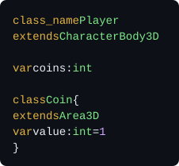</a>

See `gd++ man classes` and `gd++ man includes`.

### Functions

<a href="readme/svg/functions.gd++">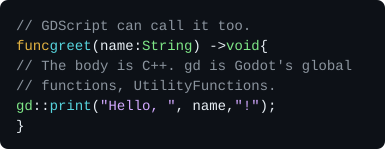</a>

See `gd++ man functions`.

### Variables

<a href="readme/svg/variables.gd++">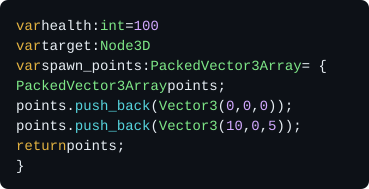</a>

See `gd++ man variables`.

### Signals

<a href="readme/svg/signals.gd++">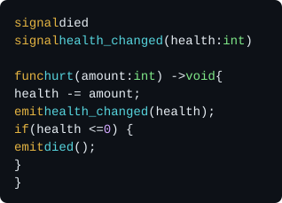</a>

See `gd++ man signals`.

### Exports

<a href="readme/svg/exports.gd++">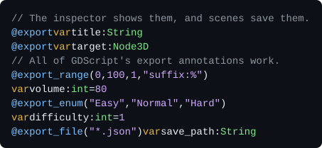</a>

See `gd++ man exports`.

### Default values

<a href="readme/svg/defaults.gd++">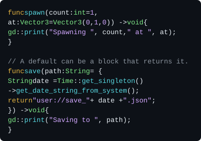</a>

See `gd++ man functions`.

### Enums and constants

<a href="readme/svg/enums.gd++">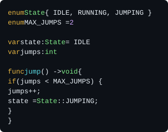</a>

See `gd++ man enums`.

### Bitfield enums

<a href="readme/svg/bitfield.gd++">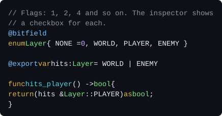</a>

See `gd++ man enums`.

### Properties

<a href="readme/svg/properties.gd++">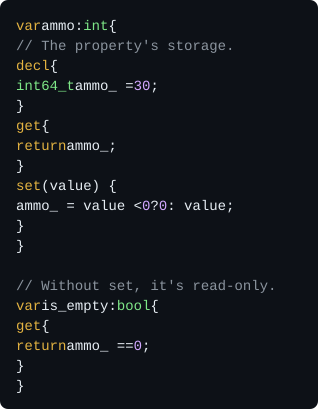</a>

See `gd++ man variables`.

### Ready-time initial values

<a href="readme/svg/onready.gd++">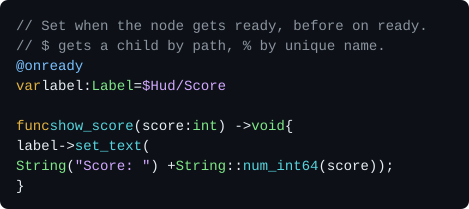</a>

See `gd++ man variables`.

### Notifications

<a href="readme/svg/engine.gd++">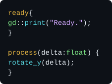</a>

See `gd++ man notifications`.

### Overrides

<a href="readme/svg/override.gd++">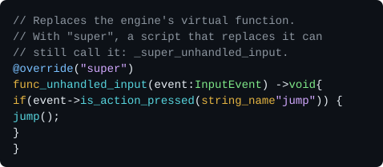</a>

See `gd++ man functions`.

### Typed arrays and dictionaries

<a href="readme/svg/typed_collections.gd++">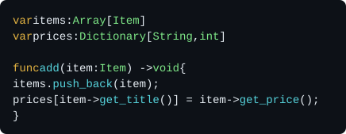</a>

See `gd++ man types`.

### Creating and deleting objects

<a href="readme/svg/create.gd++">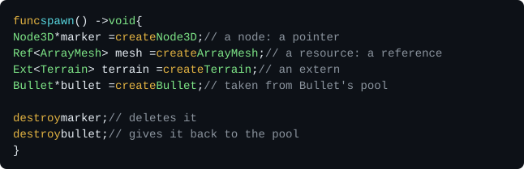</a>

See `gd++ man classes` and `gd++ man gd`.

### Casts

<a href="readme/svg/cast.gd++">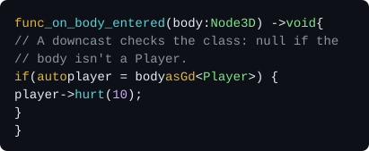</a>

See `gd++ man cast`.

### Assertions

<a href="readme/svg/asserts.gd++">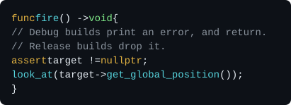</a>

See `gd++ man rewrites`.

### Doc comments

<a href="readme/svg/docs.gd++">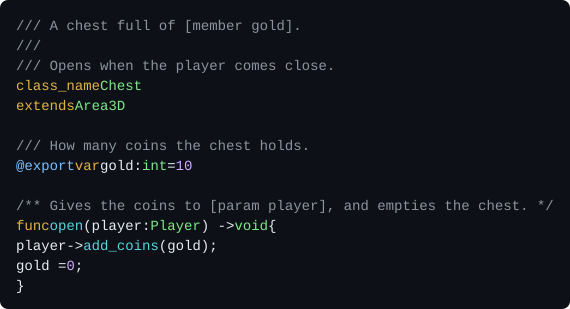</a>

See `gd++ man docs`.

### Const and static functions

<a href="readme/svg/const_static.gd++">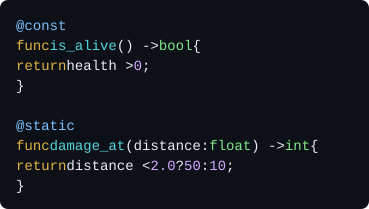</a>

See `gd++ man functions`.

### Inspector sections

<a href="readme/svg/sections.gd++">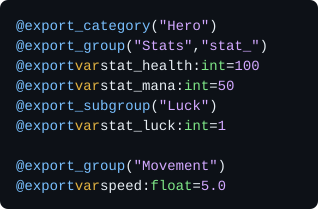</a>

See `gd++ man exports`.

### Virtual functions

<a href="readme/svg/virtual.gd++">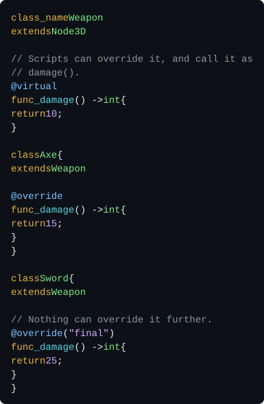</a>

See `gd++ man functions`.

### Constructors and destructors

<a href="readme/svg/ctor_dtor.gd++">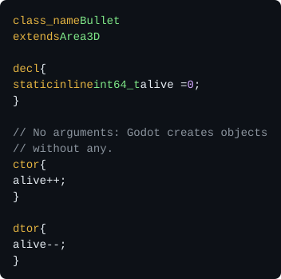</a>

See `gd++ man lifecycle`.

### Deferred functions

<a href="readme/svg/deferred.gd++">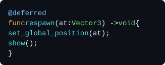</a>

See `gd++ man functions`.

### Thread-safe functions

<a href="readme/svg/thread_safe.gd++">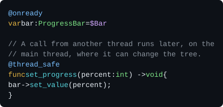</a>

See `gd++ man functions`.

### Functions on worker threads

<a href="readme/svg/onthread.gd++">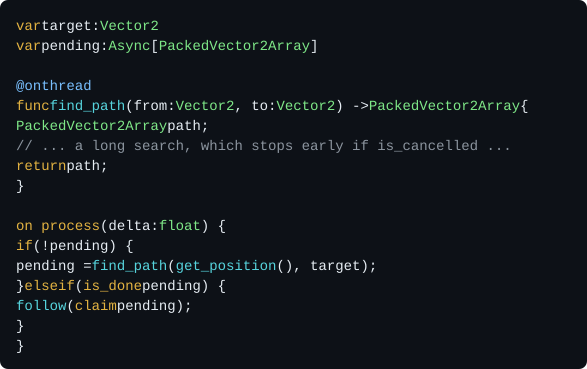</a>

See `gd++ man async`.

### Coroutines and await

<a href="readme/svg/async.gd++">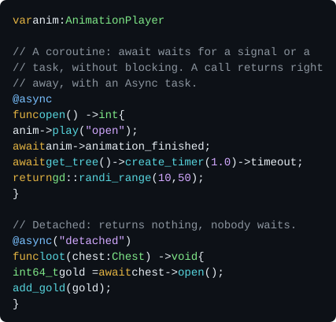</a>

Like GDScript's `await`. Scripts await a task with `await task.until_done()`.

See `gd++ man async`.

### Compute shaders

<a href="readme/svg/shaders.gd++">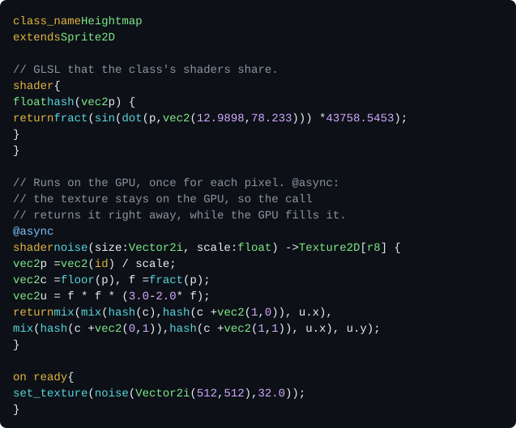</a>

Shaders are functions written in GLSL, which run on the GPU. Without one, e.g. on a dedicated server, they run on the CPU. A call waits for results that come back to the CPU, e.g. an `Image`, and returns others right away. With `@async`, it returns an `Async` instead, which is done once the GPU is.

See `gd++ man shaders`.

### Tool classes

<a href="readme/svg/tool.gd++">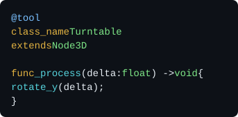</a>

See `gd++ man classes`.

### Scene classes

<a href="readme/svg/scene.gd++">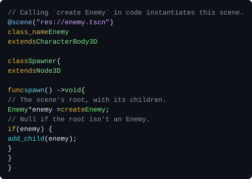</a>

See `gd++ man classes`.

### Extending enums

<a href="readme/svg/enum_extends.gd++">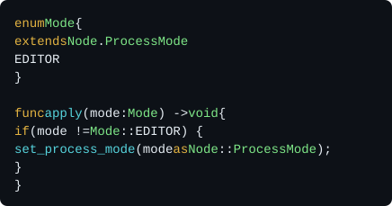</a>

See `gd++ man enums`.

### Traits

<a href="readme/svg/traits.gd++">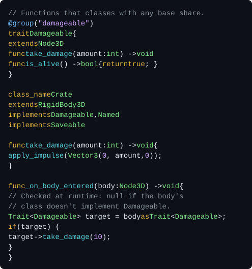</a>

See `gd++ man traits`.

### Weak references

<a href="readme/svg/weak.gd++">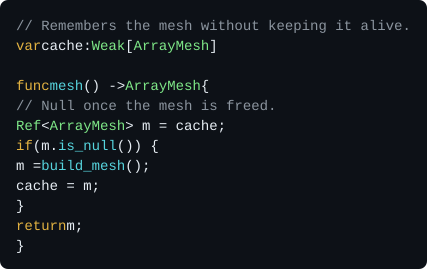</a>

See `gd++ man types`.

### Remote procedure calls

<a href="readme/svg/rpc.gd++">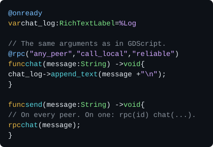</a>

See `gd++ man rpc`.

### Object pools

<a href="readme/svg/pools.gd++">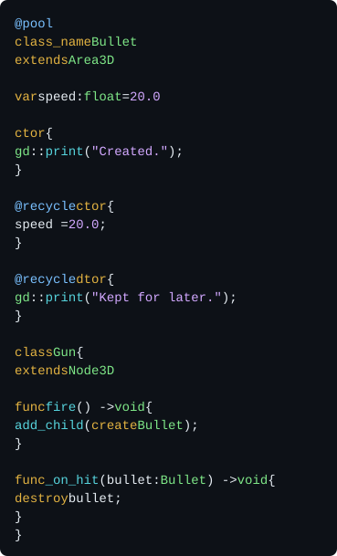</a>

See `gd++ man pools`.

### Tracing

<a href="readme/svg/trace.gd++">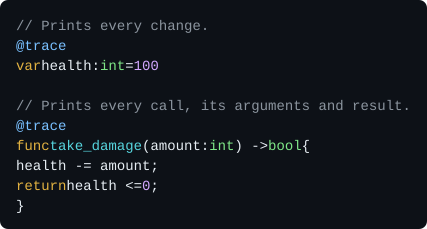</a>

With `gd++ build --trace Player`, the game prints:

```out
[f812] ▶ Player "Hero".take_damage(amount: 5)
[f812]   Player "Hero".health: 100 → 95  (in take_damage)
[f812] ◀ Player "Hero".take_damage → false  12.4 µs
```

See `gd++ man debugging`.

### Profiling

<a href="readme/svg/profile.gd++">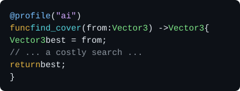</a>

With `gd++ build --profile ai --print`, the game prints a table every 10 seconds:

```out
━━ GD++ profile · last 10.0 s · 600 frames · debug, unoptimized ━━━━━━━━━━━━━━━━━━━━━━━━━━━━━━━━━━━━━━━━━━━━━━━━━━━━━━━━
Function                 Thread       Calls    Total ms     Self ms      Avg µs      Max µs    ms/frame  Budget (60 FPS)
────────────────────────────────────────────────────────────────────────────────────────────────────────────────────────
Soldier.find_cover         main        1200      846.31      846.31      705.26     4210.55       1.411             8.5%
Soldier.pick_target        main         600       41.82       41.82       69.70      290.04       0.070             0.4%
```

See `gd++ man debugging`.

### Externs

<a href="readme/svg/externs.gd++">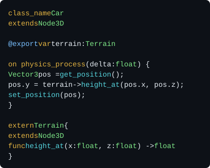</a>

See `gd++ man externs`.

### Cached string names

<a href="readme/svg/string_name.gd++">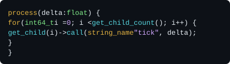</a>

See `gd++ man runtime`.

### C++ blocks

<a href="readme/svg/code_blocks.gd++">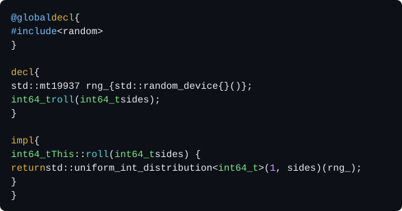</a>

See `gd++ man code`.

### Forcing and preventing includes

<a href="readme/svg/import.gd++">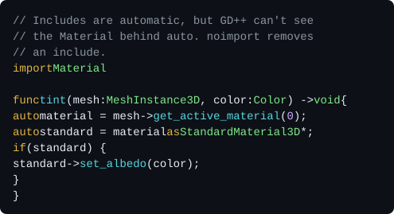</a>

See `gd++ man includes`.

### Templates

<a href="readme/svg/templates.gd++">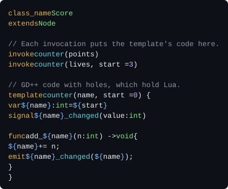</a>

See `gd++ man templates`.

### Macros

<a href="readme/svg/macros.gd++">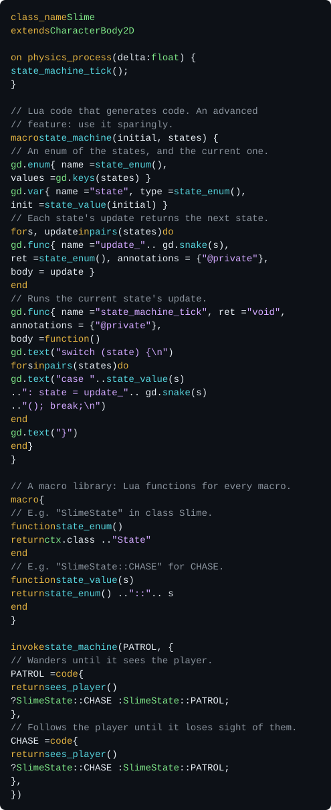</a>

See `gd++ man macros`.

### User annotations

<a href="readme/svg/user_annotations.gd++">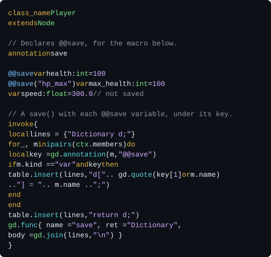</a>

See `gd++ man annotations`.

## The build tool

- A **project** is a normal Godot project.
- A **package** is a directory with a `.gd++pkg` file. It builds into one GDExtension library.
- **Dependencies** are the Godot C++ bindings (godot-cpp) and the Godot API specs.

```sh
gd++ init --vcs git                                       # keep GD++'s files out of git
gd++ init . --bind 10.0.0-stable --spec 4.7.2-stable      # make the project root a package
gd++ init tools --bind 10.0.0-stable --spec 4.7.2-stable  # or add a package anywhere

gd++ fetch --index            # list the dependencies that are available
gd++ fetch --missing          # download what the packages need
gd++ checkin --spec 4.7.2-stable   # commit a dependency with the project
gd++ vendor --spec my-4.7 --from my-4.7   # add a custom one, e.g. from your own Godot build

gd++ build                    # build the packages in the current directory, for this machine, in debug mode
gd++ build res://...          # build every package of the project
gd++ build --ship --for l.x64 w.x64   # release builds for Linux and Windows
gd++ clean                    # delete their build caches

gd++ ls                       # an overview of the project
gd++ trans player.gd++        # print the C++ that GD++ generates from a file
gd++ doc TypedArray           # show what godot-cpp declares under a name
gd++ cat player.gd++          # show a file, highlighted
gd++ fix                      # tidy up the project
```

The build writes the libraries and a `.gdextension` file into the package root, so Godot loads them right away.

A package can also hold plain C++ classes, written the usual godot-cpp way. `gd++ init . --class Foo --include pkg://foo.h` registers them with Godot. Add `--ptr`, or `--ref` for refcounted classes, to let GD++ code use them by name.

## Status

GD++ is ready to be used, but it's still experimental, and comes with **absolutely no warranty**. Syntax versions are designed for backward compatibility, but no guarantees can be given yet.

| Syntax | Status |
|---|---|
| 0 | Nightly: the language as it's being developed. Never use it in production. |
| 1 | Stable in theory, but experimental in practice. |

Each package chooses its syntax version in its `.gd++pkg`.

## See also

- [Foliage3D](https://github.com/caphindsight/Foliage3D): a realistic project by the same author, written fully in GD++, which shows what GD++ can do.
- [gdpp-vim](https://github.com/caphindsight/gdpp-vim): Vim bindings for GD++.
- [Godot Object Compiler](https://github.com/LucaTuerk/godot-object-compiler): a similar project, which generates the boilerplate of GDExtensions from macros in plain C++ code.

## License and credits

GD++ is licensed under the [MIT License](LICENSE).

GD++ was created by [caphindsight](https://github.com/caphindsight). If GD++ helps you make a game, a mention in its credits would be very much appreciated. The MIT License doesn't require it.
